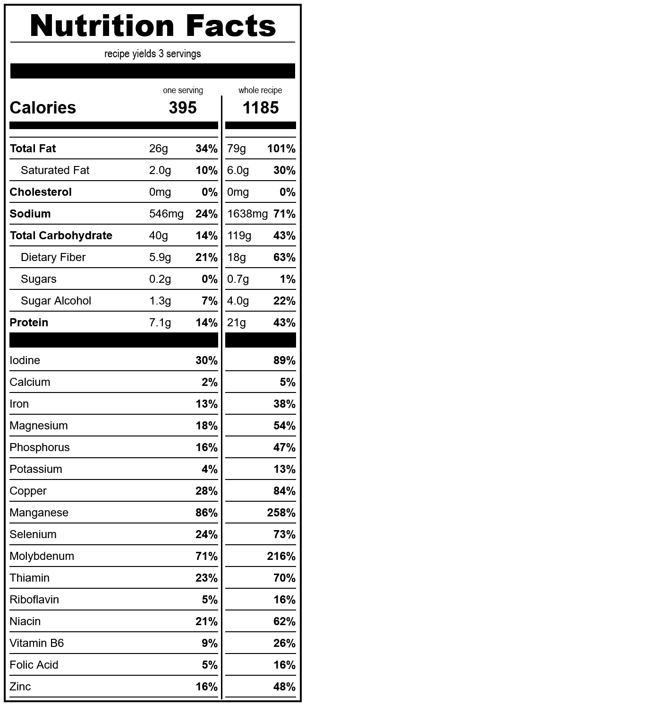

# aebleskivers
*yield: 3 servings*

### ingredients
- 1 1/2 c water
- 1/2 t salt
- 1 t erythritol
- 1/3 c sourdough starter
- 1 c whole wheat flour
- 1 t baking powder
- 1/8 t guar gum
- 1/3 c oil

 

### directions:

Combine all ingredients, **except for the oil.**

Cook in an aebleskiver pan (add ~¼ teaspoon of oil to each divet before pouring the batter).

 

### calculated ingredient cost:

$0.60 for the whole recipe, $0.20 per serving

 

