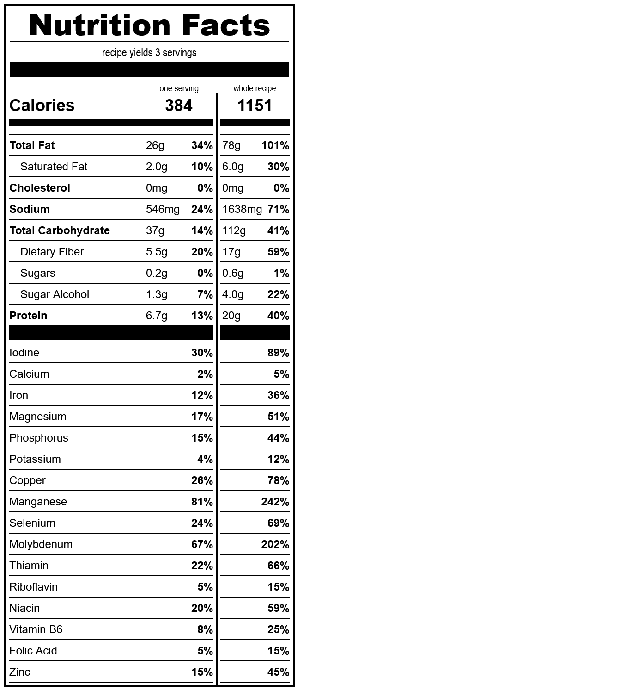

# aebleskivers
*yield: 3 servings*

### ingredients
- 1 1/2 c water
- 1/2 t salt
- 1 t erythritol
- 1/4 c sourdough starter
- 1 c whole wheat flour
- 1 t baking powder
- 1/8 t guar gum

 

### directions:

Combine all ingredients, then cook in an aebleskiver pan.

 

### calculated ingredient cost:

$0.36 for the whole recipe, $0.12 per serving

 

