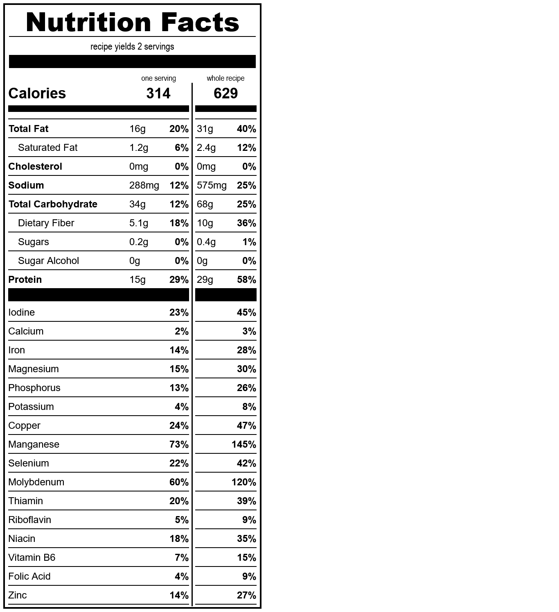

# crepes
*yield: 2 servings*

### ingredients
- 1 c water
- 1/4 t salt
- 1/2 T erythritol
- 2 T oil
- 1/4 c sourdough starter
- 1/2 c whole wheat flour
- 3 T gluten
- 1/8 t guar gum

 

### directions:

probably just Google [how to cook crepes](https://www.google.com/search?q=how+to+cook+crepes)

 

### calculated ingredient cost:

$0.60 for the whole recipe, $0.30 per serving

 

