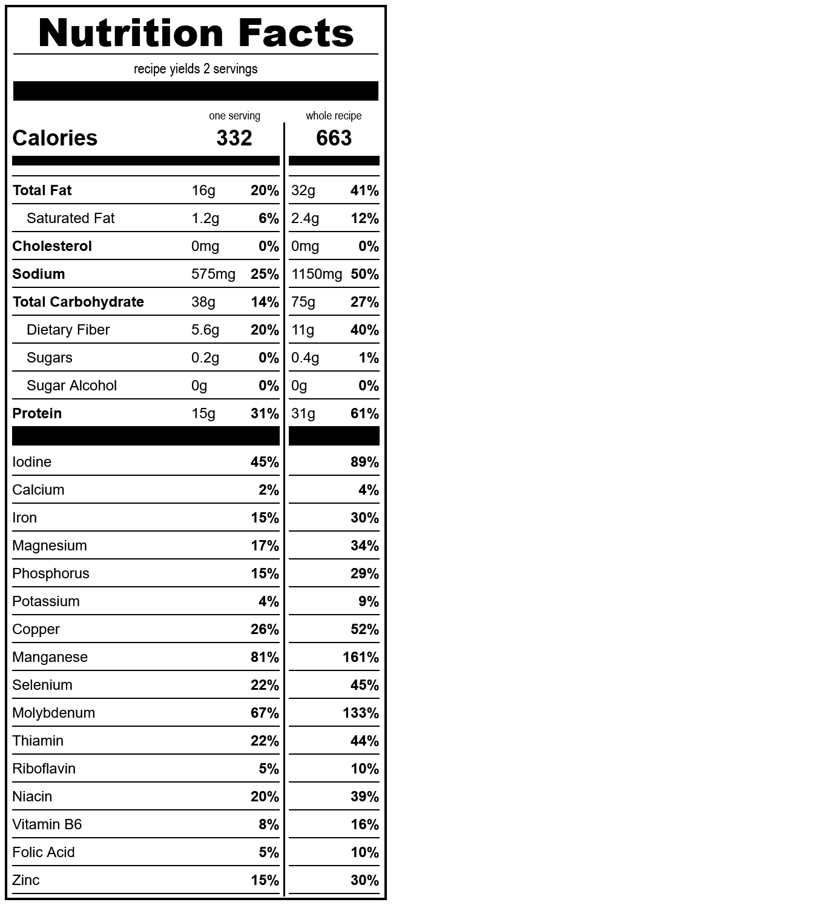

# crepes
*yield: 3 servings*

### ingredients
- 1 c soy milk
- 1/2 t salt
- 1/4 c oil
- 1/4 c water
- 1/4 c sourdough starter
- 3/4 c whole wheat flour
- 2 T gluten
- 1/8 t guar gum

 

### directions:

figure it out I guess

 

### calculated ingredient cost:

$1.08 for the whole recipe, $0.36 per serving

 

