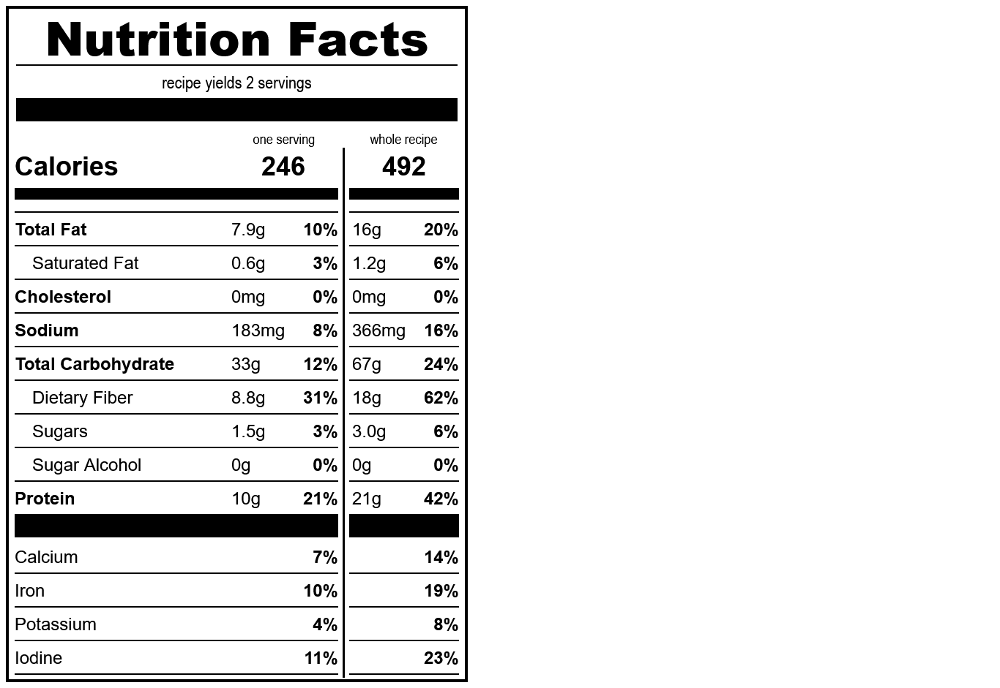

# oatmeal
*yield: 2 servings*

### ingredients
- 1 c oats
- 3 T chia seeds
- 1/8 t salt
- 1 c soy milk
- 1 T sweetener
- cinnamon or fresh fruit (optional)

 

### directions:

Pour the oats, chia seeds, salt, sweetener, and milk into a cereal bowl, one at a time.

Mix and then microwave for 2 minutes, or to your satisfaction. Let it cool a little bit and then add fruit if you want.

 

### calculated ingredient cost:

$1.05 for the whole recipe, $0.53 per serving

 

