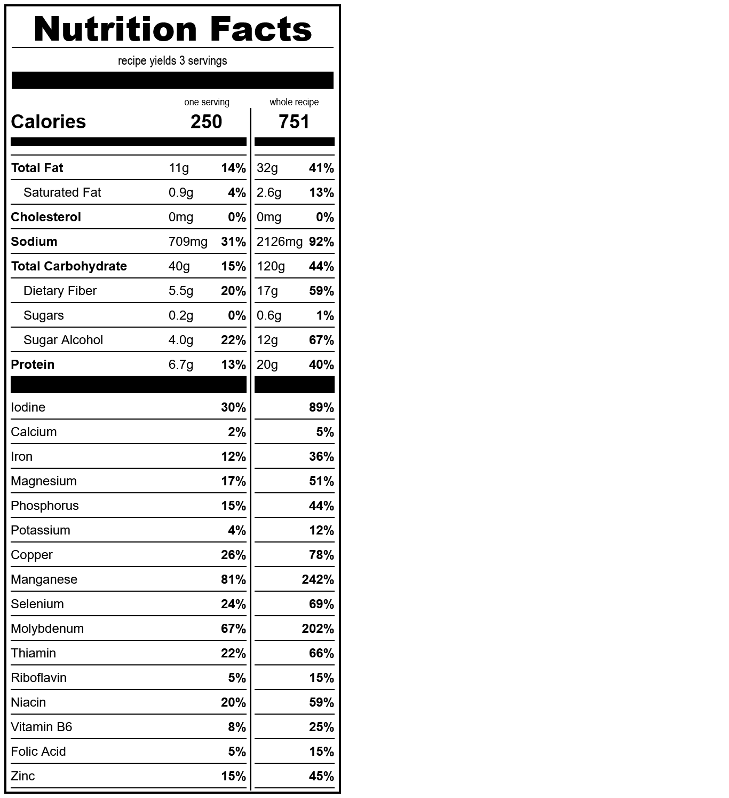

# pancakes
*yield: 3 servings*

### ingredients
- 1 c water
- 1/2 t salt
- 1 T erythritol
- 2 T oil
- 1/4 c sourdough starter
- 1 c whole wheat flour
- 2 t baking powder
- 1/8 t guar gum

 

### directions:

Mix everything in a bowl, and heat a griddle or pan to 375°F.

Hopefully you know how to flip pancakes.

 

### calculated ingredient cost:

$0.59 for the whole recipe, $0.20 per serving

 

