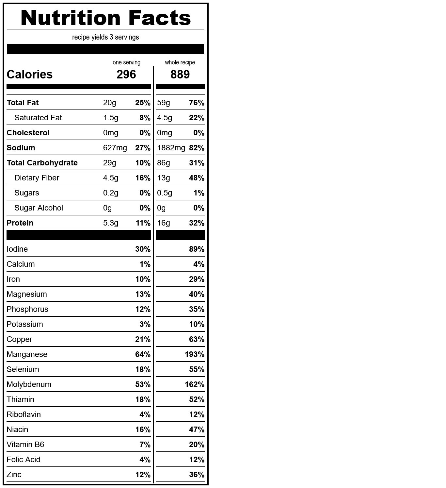

# waffles
*yield: 3 servings*

### ingredients
- 1 c water
- 1/2 t salt
- 1/4 c oil
- 2/3 c sourdough starter
- 1/2 c whole wheat flour
- 1/4 c lupin flour
- 1/2 T baking powder
- 1/8 t guar gum

 

### directions:

Mix everything in a bowl and cook as per your waffle maker's instructions.

 

### calculated ingredient cost:

$1.29 for the whole recipe, $0.43 per serving

 

