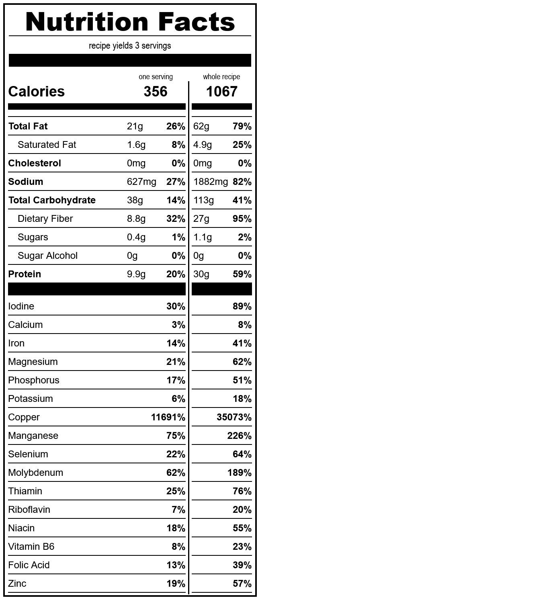

# waffles
*yield: 3 servings*

### ingredients
- 1 c water
- 1/2 t salt
- 1/4 c oil
- 100 c sourdough starter
- 2/3 c whole wheat flour
- 1/3 c lupin flour
- 1/2 T baking powder
- 1/8 t guar gum

 

### directions:

Mix everything in a bowl and cook as per your waffle maker's instructions.

 

### calculated ingredient cost:

$21.45 for the whole recipe, $7.15 per serving

 

