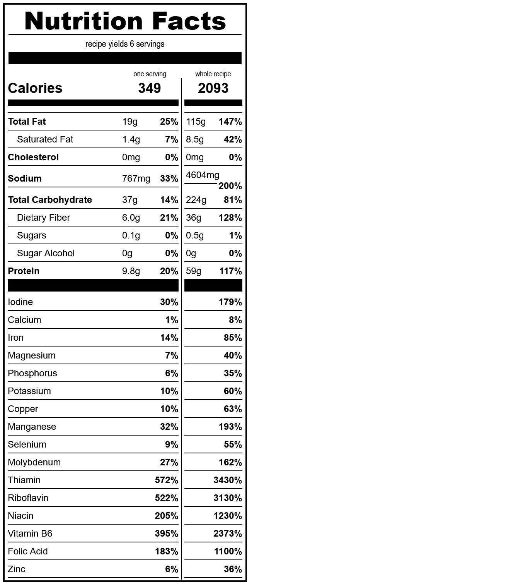

# cornbread
*yield: 6 servings*

### ingredients
- 1/2 c oil
- 1/2 c sweetener
- 1 1/2 c water
- 1 t salt
- 1 c whole wheat flour
- 1 c yellow cornmeal
- 1/2 c nutritional yeast
- 1/2 t guar gum
- 1 1/2 T baking powder

 

### directions:

Mix all ingredients and pour into glass pan.

Bake at 400°F for 20-25 min.

Serve hot, with honey or butter or whatever substitutes for those you wanna use.

 

### calculated ingredient cost:

$3.16 for the whole recipe, $0.53 per serving

 

